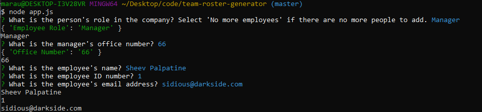
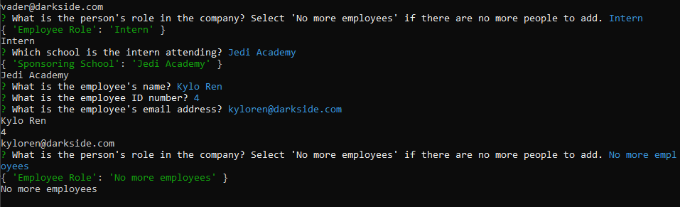
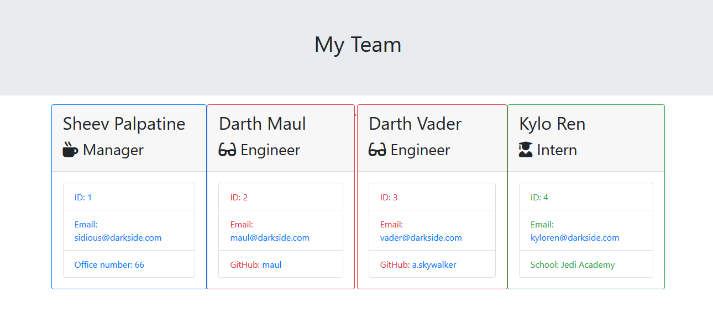

# Team Profile Generator

## About

This application serves as a tool that takes in various user information to generate a profile card for each member of your team, which is also color-coded by the employee's role and then displayed on a simple HTML webpage. The app takes the user information from a command line interface, and asks questions specific to the role that is chosen on the first prompt. When the user chooses the command 'No more employees', this function will cease and the application will produce a team.html file with all of the included profiles. This gives the user easy access to information about each member on their roster.

## Screenshots

The application kicks off with a prompt from the command line interface, asking the user to specify which role the first employee they want to add has. Then the user will fill in information specific to that role, as well as some general information about the employee.

After the user has completed filling out their roster, they will select the 'No more employees' option, which terminates the function.

The application then produces an HTML file that has a profile card for each member of their team!

## Technology

- HTML
- Bootstrap CSS
- NodeJS
- ES6
- inquirer
- path

## Link

https://marauder30.github.io/

## Author

[Nicholas Koch](https://marauder30.github.io/portfolio.html)